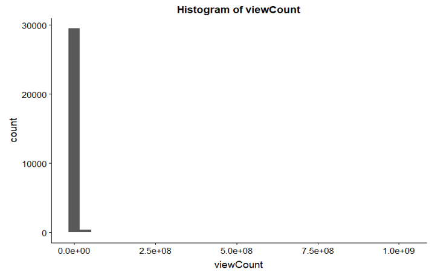
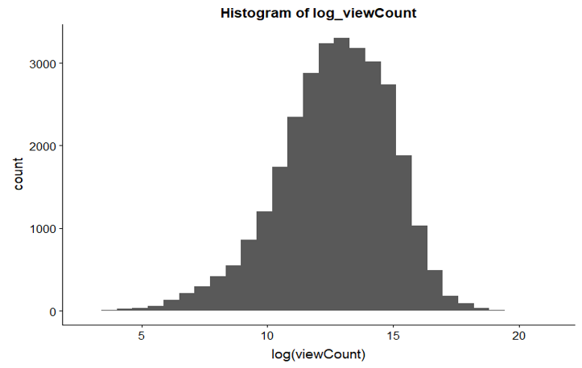

# YouTubeMLR
Using multiple linear regression to predict the number of views a video will get on YouTube

Full analysis is found in YouTubeMLR.Rmd.

# Introduction 

YouTube is a universal video sharing platform where content creators can upload videos, reaching a global range of audiences. Users of the platform can subscribe to their favorite content creators to receive notifications on when a new video is uploaded, and can like, dislike, or comment on each video. 

By launching programs such as mobile app involvement, pre-roll ads, and individual video partnerships, YouTube allows content creators to make substantial amounts of profit each year, higher than a normal industry job when successful. Therefore, running analytics on web scraped data can provide powerful and useful insights on what attributes are associated with a higher view count. Our goal is to predict the number of views of a YouTube video given certain features. 

# Data Description

1. ```Unnamed```: (int) auto incremented ID of videos

2. ```V_id```: (int) unique video ID

3. ```caption```: (categorical), a 1 is recorded when there is a caption under the video

4. ```categoryId```: (categorical) category in which the YouTube video belongs to- there are 15 YouTube categories

5. ```channelId```: (int) ID of the channel

6. ```commentCount```: (int) number of comments on the video

7. ```definition```: (categorical) describes video quality, 1 for HD, 0 for SD

8. ```dimension```: (categorical) describes the dimension of the video, 1 for 3D, 0 for 2D

9. ```dislikeCount```: (int) number of dislikes on the video

10. ```duration```: (int) length of the video in seconds

11. ```embeddable```: (categorical) 1 for embeddable video, 0 for a non-embeddable video

12. ```licencedContent```: (categorical) 1 for licensed video, 0 for a non-licensed video

13. ```likeCount```: (int) number of likes on the video

14. ```privacyStatus```: (categorical) 0 for public, 1 for private

15. ```thumbnail```: (string) link to image of the thumbnail

16. ```viewCount```: (int) number of views the video received

17. ```channel_ViewCount```: (int) number of views the channel received

18. ```channel_commentCount```: (int) number of comments the channel received

19. ```channel_subscriberCount```: (int) number of subscribers the channel has

20. ```channel_videoCount```: (int) number of videos the channel has

21. ```description_length```: (int) length of video description

22. ```tags_in_desc```: (int) number of tags in the video description

23. ```video_title_length```: (int) length of the video's title

24. ```tags_in_title```: (int) number of tags in the video title

25. ```No_of_tags```: (int) number of tags assigned by the publisher to the video 

26. ```channel_title_length```: (int) length of channel title

27. ```channel_description_length```: (int) length of channel description

28. ```months_old```: (int) how old the video is in months

29. ```channel_months_old```: (int) how old the channel is in months

30. ```day_uploaded```: (categorical) day of the week the video was uploaded

31. ```social_links```: (int) number of social links mentioned on the channel page

32. ```twitter_url```: (string) twitter URL of publisher


Data provided by https://github.com/ayush1997/YouTube-Like-predictor. 

# Data Cleaning

We want to remove certain variables from the model that we know will be problematic. These include the following variables:

1. ```Unnamed```: 0: Since this is unique and incrementing by 1 for each video, this variable won't tell us much. It isn't an actual feature of the video itself. 

2. ```V_id```: This is unique to each video and is just a random string variable that won't tell us much.

3. ```channelId```: Same as 2), but with channels. The variable is just a random string variable that won't tell us much.

4. ```thumbnail```: This gives the URL for the thumbnail image of a video. Since it's not the image itself, we can't do much with it and will not consider it. 

5. ```commentCount```: Since our response variable is the number of views a video receives, and comments can only increase if the views increase, we will remove commentCount from our model.

6. ```channel_commentCount```: Since our response variable is the number of views a video receives, and comments can only increase if the views increase, we will remove channel_commentCount from our model.  

7. ```twitter_url```: This gives us the URL for the twitter account of the content creator. Since this doesn't actually tell us anything about the content creator, we will remove twitter_url from our model.

8. ```likeCount```: The number of likes can only increase if the number of views a video receives increases. Similar to 5), we will remove likeCount.

9. ```dislikeCount```: Same reasoning as 7), but with the number of dislikes. 

10. ```privacyStatus```: There are only 3 videos in the entire dataset of 221,618 videos that are private. We will remove privacyStatus as a variable because our sample does not encapsulate the 3 private variables and the number of private variables is too small to be considered significant. 

Then we removed all null values, and we manipulated the variable channel_ViewCount so that channel_ViewCount = channel_ViewCount – viewCount.

Lastly, we took a random sample of 30,000 from our cleaned data, which we further split into a training and testing set with an 80:20 ratio. We had 24,000 observations for our training set and 6,000 observations for our test set. 

# Exploratory Data Analysis



Our response variable, viewcount, has a very skewed distribution. Let's try a log transformation shown below: 



The transformed variable has a much better distribution, so we will use it.

Please refer to our Rmd file or final PDF/HTML for the exploration of our explanatory variables. 

# Model Selection

First, we examined plots of the response variable vs all explanatory variables, and transformed problematic variables. 
Then we created a model using the transformed and untransformed variables, examined these residual plots, and made more transformations accordingly.
Lastly, we used stepwise model selection to determine our final explanatory variables. 

# Final Model

Please refer to our Rmd file or final PDF/HTML for how we arrived at our final model.

Here is our model output:


# Model Fit

Our root mean squared error was exp(2.604394) = 13.52303.
Our adjusted R-squared value was 61.09.

Here is a plot of the actual view count plotted against our predicted view count.


Our graph of the actual vs. predicted displayed above shows that our model performed decently, but not ideally (a perfect model would have more points along the straight line). 

# Conclusions
From our final model output, we can see that all of our variables are significant besides one variable- caption1, which has a p-value of 0.0838505. 

From our test statistics, we can see that some particular variables have high impact on our response variable. These variables include: ```log(Channel_View_Count)```, ```log(Channel_Video_Count)```, ```Category14```. 

Some surprising results are that social links has a negative relationship with view count - the more social links, the less views the video will get, and that the number of videos a channel has also has a negative relationship - the more videos a channel has, the less views on the predicted video.

Some limitations are that the model is good for the average case, but viral videos are hard to predict. Furthermore, Data is from snapshot in time, so it doesn’t account for change over time.
To maintain accuracy, we will need to re-evaluate the model with newer data frequently

# Authors
Daniel Zhou

Sherry Hu

Bao Van
